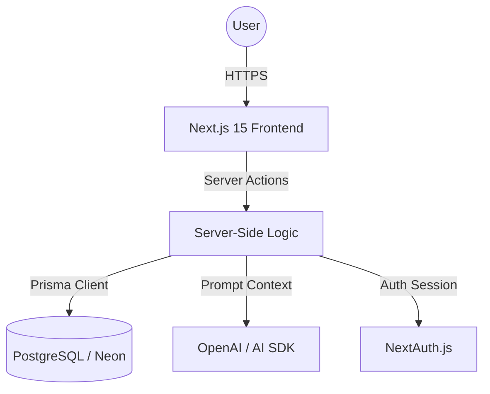

# WITHUS | Spiritual Coordination & Community Intelligence Hub

[](https://nextjs.org/)
[](https://tailwindcss.com/)
[](https://www.prisma.io/)
[](https://www.postgresql.org/)
[](https://sdk.vercel.ai/)
[](https://www.framer.com/motion/)

> **"God is with us" (임마누엘)**
> 
> A purpose-built community platform designed for the Chaplaincy Department to bridge spiritual guidance with modern digital coordination. **WITHUS** is not just a portal—it is an intelligent ecosystem that fosters connection, spiritual growth, and administrative efficiency.

---

## 📽️ Project Gallery

*Visualizing the "Spiritually Modern" experience.*

| **Feature** | **Visual Preview** |
| :--- | :--- |
| **Hero Experience** | *[IMAGE_PLACEHOLDER: Main Landing Page showing glassmorphism design]* |
| **Faith Assistant** | *[IMAGE_PLACEHOLDER: AI Chatbot interface in action]* |
| **Community Board** | *[IMAGE_PLACEHOLDER: Anonymous board with nested comments]* |
| **Admin Control** | *[IMAGE_PLACEHOLDER: Secure administrative dashboard]* |

---

## 💎 Core Pillars

### 1. Intelligent Faith Assistance
Leveraging the **Vercel AI SDK** and **GPT-4o**, WITHUS provides a context-aware spiritual assistant. It offers real-time guidance based on chaplaincy principles, acting as a 24/7 spiritual companion for students.

### 2. High-Fidelity Community board
A robust, anonymous community system featuring:
- **Nested Recursive Commenting**: Designed with a complex hierarchical data structure for deep theological and communal discussions.
- **Engagement Mechanics**: Real-time view counts and community-driven interaction (PostLikes).

### 3. Comprehensive Academic Integration
Direct integration with campus life data models including **School Calendars**, **Meal Schedules**, and **Timetables**, making WITHUS the central hub for any Chaplaincy Department operative.

### 4. Enterprise-Grade Security
- **NextAuth Integration**: Secure session management.
- **Custom Admin Approval Workflow**: Ensuring the community remains a safe, moderated spiritual space.

---

## ⚙️ Technical Architecture

The application is built on the **Next.js 15 App Router**, utilizing a modern full-stack architecture that prioritizes performance and scalability.



### Advanced Data Modeling
The system utilizes a relational schema optimized for high-read scenarios and complex recursive relationships.

```prisma
// Example: Recursive Comment Structure
model Comment {
  id        String    @id @default(cuid())
  parentId  String?
  parent    Comment?  @relation("CommentToComment", fields: [parentId], references: [id])
  replies   Comment[] @relation("CommentToComment")
  post      Post      @relation(fields: [postId], references: [id])
}
```

---

## 🚀 Deployment & Installation

### Prerequisites
- Node.js 18+
- PostgreSQL database (Recommended: [Neon](https://neon.tech))
- OpenAI API Key

### Setup
1. **Clone & Install**
   ```bash
   git clone https://github.com/your-repo/mhaa.git
   cd mhaa
   npm install
   ```

2. **Environment Configuration**
   Create a `.env` file based on `.env.example`:
   ```env
   DATABASE_URL="postgres://..."
   NEXTAUTH_SECRET="..."
   OPENAI_API_KEY="..."
   EMAIL_USER="..."
   EMAIL_PASS="..."
   ```

3. **Database Migration**
   ```bash
   npx prisma generate
   npx prisma db push
   ```

4. **Launch**
   ```bash
   npm run dev
   ```

---

## 🛠️ Built With

- **Framework**: [Next.js 15](https://nextjs.org/) (App Router, Server Actions)
- **Styling**: [Tailwind CSS 4](https://tailwindcss.com/) & [Framer Motion](https://www.framer.com/motion/)
- **Database**: [Prisma](https://www.prisma.io/) with [PostgreSQL](https://www.postgresql.org/)
- **AI**: [Vercel AI SDK](https://sdk.vercel.ai/)
- **UI Components**: [Lucide React](https://lucide.dev/) & [Tiptap Editor](https://tiptap.dev/)

---

© 2026 WITHUS. Built with purpose for the Chaplaincy Department.
